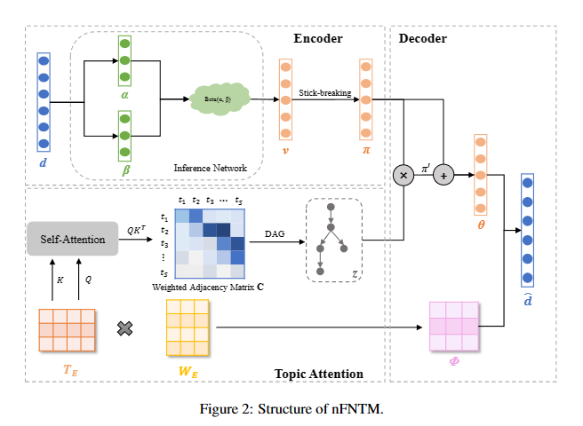
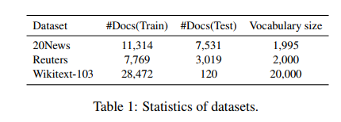
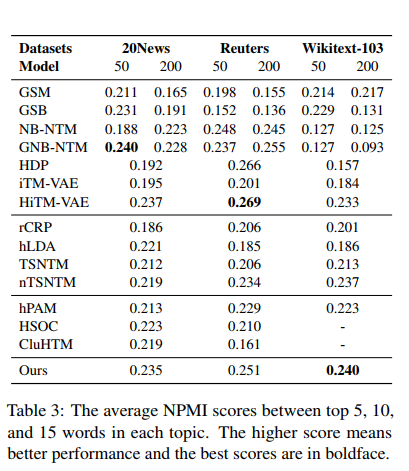

# Code for Nonparametric Forest-Structured Neural Topic Modeling

Implementation of Nonparametric Forest-Structured Neural Topic Modeling by pytorch.


## Framework


the structure of nFNTM


## Environment

```
nltk==3.6.5
numpy==1.21.4
PyYAML==6.0
tokenizers==0.10.3
torch==1.9.1
torchvision==0.2.2
```

## Run

```bash
pip install -r requirements.txt
bash run.sh
```
## Datasets



Statistics of datasets

## Results

 


