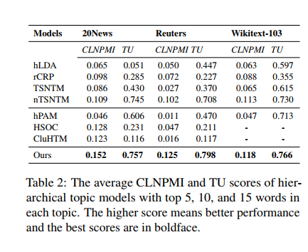
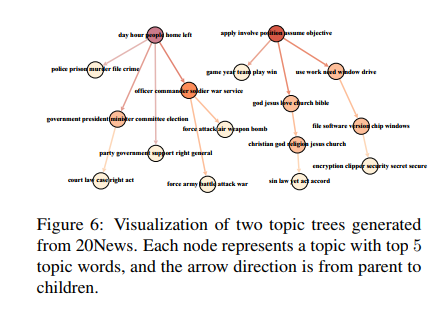
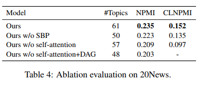

# Code for Nonparametric Forest-Structured Neural Topic Modeling

Implementation of Nonparametric Forest-Structured Neural Topic Modeling by pytorch.


## Abstract  

Neural topic models have been widely used in discovering the latent semantics from a corpus. Recently, there are several researches on hierarchical neural topic models since the relationships among topics are valuable for data analysis and exploration. However, the existing hierarchical neural topic models are limited to generate a single topic tree. In this study, we present a nonparametric forest-structured neural topic model by firstly applying the selfattention mechanism to capture parent-child topic relationships, and then build a sparse directed acyclic graph to form a topic forest. Experiments indicate that our model can automatically learn a forest-structured topic hierarchy with indefinite numbers of trees and leaves, and significantly outperforms the baseline models on topic hierarchical rationality and affinity.

## Framework


<!-- the structure of nFNTM -->


## Environment

```txt
nltk==3.6.5
numpy==1.21.4
PyYAML==6.0
tokenizers==0.10.3
torch==1.9.1
torchvision==0.2.2
```

## Run

```bash
pip install -r requirements.txt
bash run.sh
```
## Datasets


<!-- the statistics of datasets -->

## Results
To evaluate the rationality, affinity, and diversity of the topic hierarchy generated by different models, we adopt four metrics: topic specialization (Kim et al., 2012), Cross-Level Normalized Point-wise Mutual Information (CLNPMI) (Chen et al., 2021b), hierarchical affinity (Kim et al., 2012), and Topic Uniqueness (TU) (Nan et al.,
2019). Key words of each topic are ranked by the topic-word matrix Φ (Blei et al., 2003b).
### NPMI and CLNPMI

<br/>


### Topic Hierarchical Rationality
 <br/>

<!--  -->

### Visualization
Visualization of the topic forest generated from 20News. Each node represents a topic and the arrow direction is from parent to children.   
There are about 8 trees in the forest, two of which have complex levels and structures, and two trees have only one root node.


## Citation
If you want to use our code, please cite as
```
@inproceedings{DBLP:conf/coling/ZhangZR22,
  author       = {Zhihong Zhang and Xuewen Zhang and Yanghui Rao},
  editor       = {Nicoletta Calzolari and Chu{-}Ren Huang and Hansaem Kim and James Pustejovsky and Leo Wanner and Key{-}Sun Choi and Pum{-}Mo Ryu and Hsin{-}Hsi Chen and Lucia Donatelli and Heng Ji and Sadao Kurohashi and Patrizia Paggio and Nianwen Xue and Seokhwan Kim and Younggyun Hahm and Zhong He and Tony Kyungil Lee and Enrico Santus and Francis Bond and Seung{-}Hoon Na},
  title        = {Nonparametric Forest-Structured Neural Topic Modeling},
  booktitle    = {Proceedings of the 29th International Conference on Computational
                  Linguistics, {COLING} 2022, Gyeongju, Republic of Korea, October 12-17, 2022},
  pages        = {2585--2597},
  publisher    = {International Committee on Computational Linguistics},
  year         = {2022},
  url          = {https://aclanthology.org/2022.coling-1.228},
  timestamp    = {Thu, 13 Oct 2022 17:29:38 +0200},
  biburl       = {https://dblp.org/rec/conf/coling/ZhangZR22.bib},
  bibsource    = {dblp computer science bibliography, https://dblp.org}
}
```
